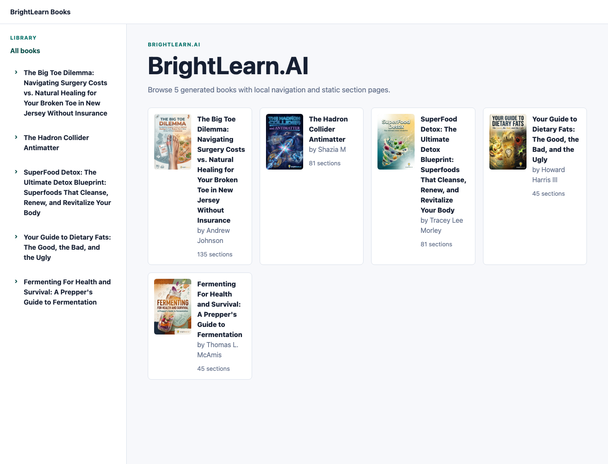
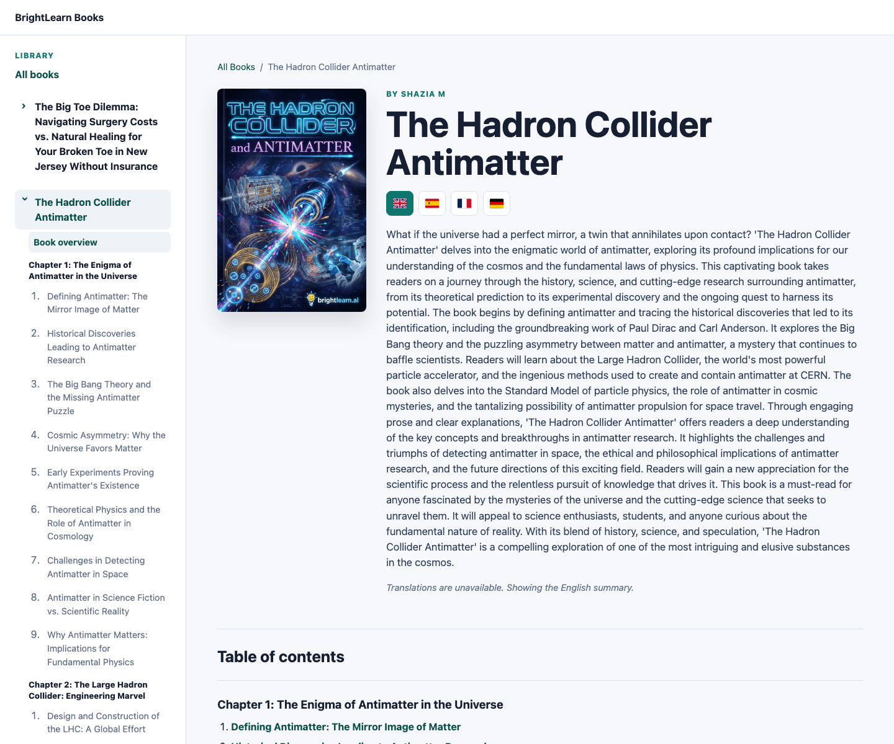

# Expected Output Preview

This folder contains a small committed preview of the generated static output so reviewers can see
what a successful render looks like before running the project locally.

The full sample dataset output is intentionally not committed because `rendered/` is runtime output
and the complete 5-book sample currently produces hundreds of HTML files. Reviewers should generate
the full output with:

```bash
PYTHONPATH=src python -m brightlearn_site render data/samples/brightlearn_books.json --skip-translations
```

Then open:

```text
rendered/brightlearn_books/index.html
```

## Screenshots From A Successful Sample Render

Dataset index:



Book page with language flags and chapter/section sidebar:



## Compact HTML Snapshot

A small static HTML snapshot is committed at:

```text
docs/sample-output/manual_batch_beta/index.html
```

It was generated from:

```text
data/manual_tests/batch-three-files/manual_batch_beta.json
```

The snapshot is complete for the compact fixture: dataset index, one book page, two section pages,
CSS, JavaScript, favicon, and flag assets. It is meant as a lightweight preview only; the full
5-book BrightLearn output should still be generated with the commands in the root README.

If viewing from a local clone, open:

```bash
open docs/sample-output/manual_batch_beta/index.html
```

On Windows PowerShell:

```powershell
start .\docs\sample-output\manual_batch_beta\index.html
```
